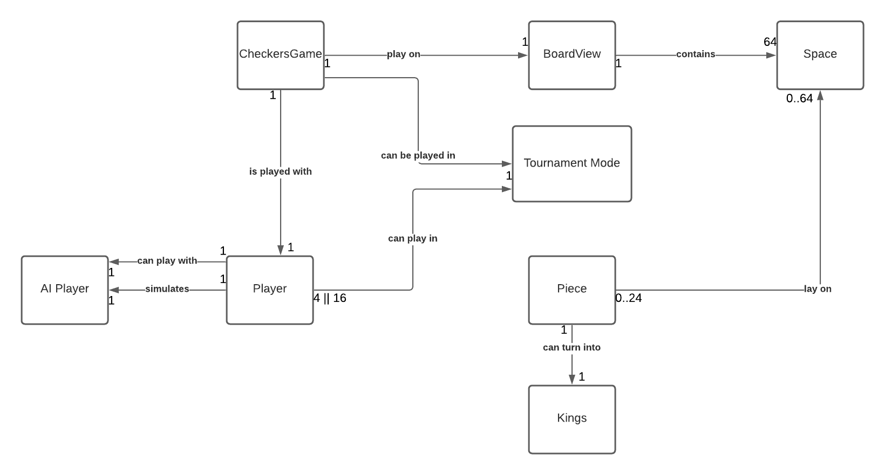
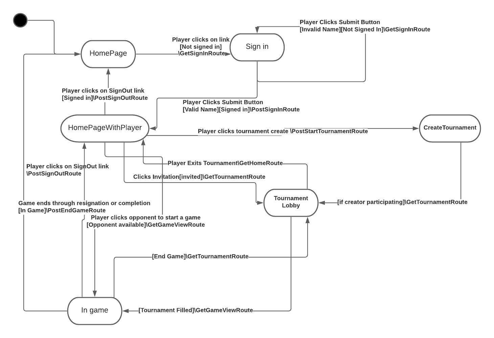
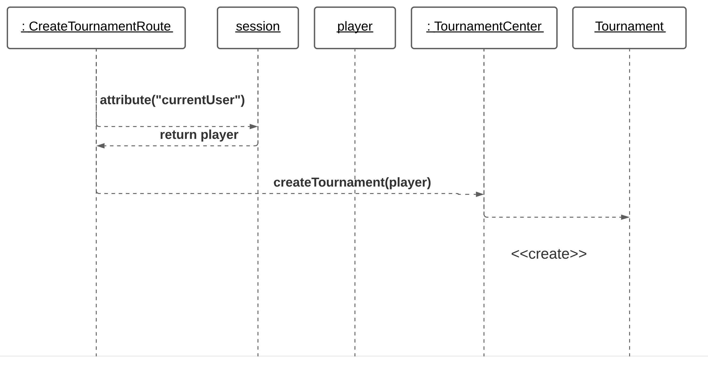
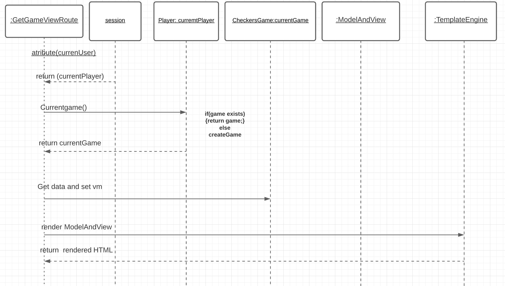
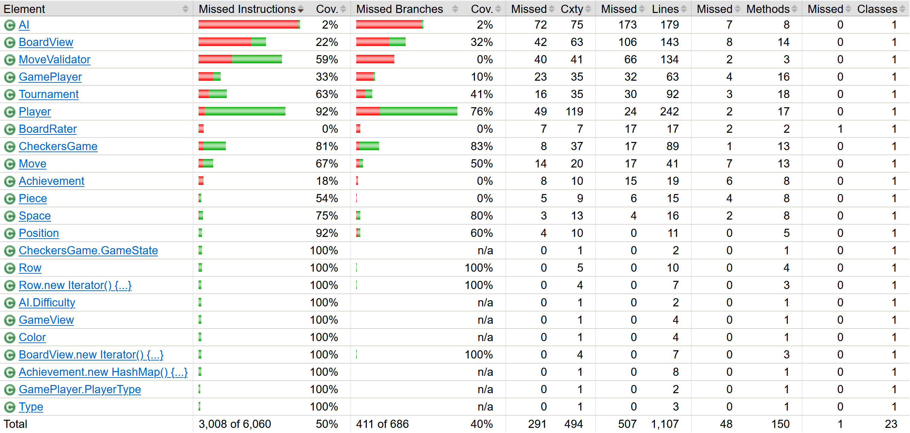
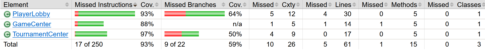
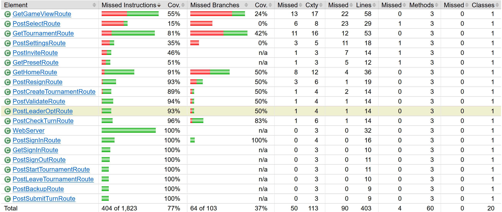

---
geometry: margin=1in
---
# PROJECT Design Documentation

## Team Information
* Team name: Please Stand By
* Team members
  * Morgan Kreifels
  * Max Shenk
  * Aiden Green
  * Zach Montgomery
  * Steven Feldman

## Executive Summary

WebCheckers is a browser game meant to simulate checkers online.
Users sign in with their name and choose an opponent to play against from a list of players that are online and not in a game.
Any two of the players can win the game by normal means or their opponent resigning.
After the game ends and a player wins, both players will be returned to the home page where they can play another game or sign out.

### Purpose

> This project will allow online players to play games with other
> online opponents. Our project focuses on the players that will be playing games.
> The most important user goals are for the user 
> to log in to start a game, start a game with any player, and 
> then play that game until a player wins.

### Glossary and Acronyms

| Term | Definition |
|------|------------|
| VO | Value Object |
| MVP |Minimal Viable Product|
|Enhancements|Additional terms to the MVP|
|AI| Artificial Intelligence; a simulated player |

## Requirements

### Definition of MVP
>The Minimal Viable Product is the software that will fill the basic 
> objectives that will delight the user. This product can fully 
> function on its own with no further enhancements. The MVP for this
> product is for the user to be able to sign in, start a game with online
> players, play a game, and win or lose games.
>  
### MVP Features
> Every player will be able to sign-in before playing a game and
> then sign-out whenever the player is finished playing games.

> Two players that are online will be able to play a game of checkers
> with each other based off the American Rules. These players choose
> one another from a list of online players on the home page

>These two players will then see a checkers board that is updated with
> every move. The game will continue until a player resigns, when the
> opposing player has no more pieces, or the opposing player has
> no more valid moves.

>Either player will be able to resign at any point, which will make the
> opposing player the winner of that game.

>After a player wins, both players will then be directed back to
> the list of online players.

### Roadmap of Enhancements
> The first feature that we will implement is the ability for the players to play in a checkers tournament. 
> One player will be able to create a tournament, and add players to that tourney.
> This tournament will be based on single-bracket elimination, also known as a pyramid.
> When the tournament starts, players will be assigned to their opponents randomly. The tournament
> creator will still be able to randomly mix the seed again if wanted.
> The tournaments' wins or losses will affect the win-rate of the player.

>The second feature will implement an AI player that any online player can play against.
> This game can be compared to playing with a human player. 
> There will be three levels of AI: Sputnik (Hard), MediumBot (Medium), and Gary (Easy).
> These AIs will be listed among the players' list, which features the players that are online.
> When a player defeats an AI, they will get a badge next to their name saying they have won against them.
> Then, winning again the AI will also affect the win-rate of the player.
> The human player will always start, and the AI will not be able to resign.

 
## Application Domain

> Checkers game will be the manager of the application of checkers and 
> then translated into the online server. 
 
> BoardView will control the way the players will see the board and how 
> they will interact with the board. This board will contain 64 spaces.
> These spaces will be occupied with pieces that the player will place down.
 
> The player will control up to 12 checker pieces per game. These pieces will 
> be able to change into king pieces in the game. 

>The AI player is based off of a player and this AI can be played with
> players.

>The checkers game can than be played in a tournament mode, where 
> players will be able to play in a tournament-based game play.

## Architecture and Design

The Program is a web application with UI, Application, and Model tier methods that handle a straightforward game of
online checkers. Our Model tier handles everything to do with the checkers game's logic, such as the position of the
pieces and each move. It also stores all the data of the game, every nook and cranny. The UI tier handles everything to
do with user interface (obviously), menus, the webapp, connections with other players, and essentially everything not a
part of the core checker's game. The Application tier is like a controller between the Model and the UI, translating the
inputs of the player into effects on the program, and returning the responses the system produces back to the player.

### Summary

The following Tiers/Layers model shows a high-level view of the webapp's architecture.

As a web application, the user interacts with the system using a
browser.  The client-side of the UI is composed of HTML pages with
some minimal CSS for styling the page.  There is also some JavaScript
that has been provided to the team by the architect.

The server-side tiers include the UI Tier that is composed of UI Controllers and Views.
Controllers are built using the Spark framework and View are built using the FreeMarker framework.
The Application and Model tiers are built using plain-old Java objects (POJOs).

Details of the components within these tiers are supplied below.

### Overview of User Interface

This section describes the web interface flow; this is how the user views and interacts
with the WebCheckers application.

> First, all users will start at the HomePage this page will provide
> a link to sign in. If the player is not signed in the player will be brought 
> to a sign-in page. If the player does not type in a valid sign-in 
> name then the player will stay on the sign-in page until a valid name is
> inputted. After a valid name is entered the user will be taken to the 
> home page.

> Once the player is signed in, they will be brought to the home page,
> with the list of online players. From here a player can click on 
> players to play a game with if that player is not in a game. Then both 
> players will be brought to a view of the game to start playing. If
> the player is not available the user will stay on the home page.

>From the homepage the player will be able to create a tournament and add other online players.
>This creation will send an invitation to those players, and they have the choice to join 
> the tournament or not. The creator of the tournament will be able to set the size of the tournament
> (in increments of four) and decide if they will want to play in the game. Here is the route to be 
> able to create the tournament.

>Once the specific amount of players have joined the tournament then the games will start. Once the players lose a game, they
> will be sent to the home page. The players will go to the games automatically when they finished a game.
> After the tournament is finished the winner will get a winner message and all players will be sent 
> to the home page.

>The player can also play three different leveled AI's. This will play no differently than playing 
> against a normal player online. More than one player can play against the AI at once, unlike playing
> against other players. 

> When a game is over or a player resigns, both players will be brought
> back to the home page with the list of players. If the player signs out
> in the middle of the game, then the player will be returned to the 
> home page without the list of players. The player still signed in then
> they will be returned to the home page with players.

### UI Tier

As the user first connects to the WebCheckers webpage the server will display the homepage
by accessing the GetHomeRoute, this will display the homepage that only
displays the number of players online and the available link to log in.

When the user clicks on the sign-on link, this will make the server connect to 
the GetSignInRoute. This route will display the SignInPage to the user. This will 
show a text box that the user can type in a username. Once the user types in a name and 
presses the sign-in button, the server will then connect to the PostSignInRoute.
Here is where the name will be validated through the player lobby, and the
player lobby will return true if the user typed in a valid username, if the 
player lobby returned false then the server will return the sign-in page 
with an error message.Once the user has a correct, the server will redirect
to the homepage.

The homepage displayed to the signed-in user will contain the list of players
that are signed. It will show if the player is available to play a game or is 
currently in a game. From this homepage the players can start games with each other
or sign out.

When a user clicks on a user to start a game, the server will access the
GetGameViewRoute. If the player is available to play a game, then both players 
will be displayed the checkers game. If the player selected is already in a game,
then the one who selected will be returned back to the home page with an error.
As the game is able to be played on mulitple routes can be selected from the server.
The figure below is a visual way to understand the GetGameViewRoute.

After each move, the server will PostValidateRoute which will validate the move
to check to see if the move made by the player follows the American Checkers rules.

When the player is in the process of deciding which move to submit, the player can redo 
their moves to return to the last submitted move. This move can be retrieved when the server access 
PostBackuproute.

Once the player has decided which move to submit, they will click the submit button and the server
will save the move for further usages by going to PostSubmitTurnRoute. The server will also keep
tracking whose turn is next, by accessing PostCheckTurnRoute.

The POST /checkTurn route is automatically requested every 5 seconds by the browser. When it is invoked, the program simply retrieves the player, accesses the game that player is in, and uses a helping Model function to return the Color of the players whose turn it is. The handling method then compares the given color to the color of the player who called the route. If the color is the same(its their turn), then the "true" string is put into an INFO Message and sent back via response. In a case where it is not their turn(Colors do not match), the Message returned is instead an ERROR, and the "false" string is attached.

When the players are done playing, then the users will be returned to the homepage by the serving accessing GetHomeRoute
If a another player wants to play with one of the players, then that player will be 
returned to another game board. 

The game can also be done when a player resigns. The server will access
the PostResignRoute will process the views that each player will receive.

If the POST /signout route is accessed, the session is retrieved from the associated HTTP request, and then the Application level playerLobby is called to handle the true "signing out" of the player(player object being removed from collection, freeing username, etc).

From the homepage, when the user clicks the button to create a tournament, the POST /tournament route is called which then creates the tournament
in the model tier. Once the model creates a tournament, the user is redirected to the GET /tournament and the tournament.ftl is generated to display all information
about the tournament they created including the number of players required, list of invitable players, a leave button, a seed button, and tournament settings.

Similarly, when a user clicks on a tournament invite from another player, instead taking the POST /tournament route, the user directly takes the GET /tournament
route. Since the player didn't create the tournament and simply joined it, their tournament.ftl is designed to display a much simpler view, only including 
the other players in the lobby, as well as a leave option.

If a leader clicks a players name from then invite list, the POST /invite route is called and the model sends an invite to the respective player.

The leader can choose to opt out of the tournament by clicking an "Sit out" button. The POST /opt is taken and the player is removed from the 
participant list, but maintains control of the tournament. If the button is clicked again(renamed to Rejoin), the player is simply readded by taking 
the POST /opt route again.

For the leader, when the settings are changed(currently only the max player count) the POST /settings route is taken and given the queryParams that 
are different depending on the setting clicked on the tournament page, gives the model information on what tournament setting to change.

Both players and leaders can leave the tournament which calls the POST /leaveTournament route and takes them from the tournament in the model, then
redirecting them to the GET / (home) route.

As the creator of a tournament, when the player count is sufficient to start the tournament when you click the start button, the POST /startTournament
 route is taken and the tournament will then initialize in the model tier and games will begin. As games begin from starting the tournament, the 
GET /game route will take them to their respective game. 

When the seed button is clicked by the leader, it simply randomizes the order of the bracket data structure so that the matchups are different.

### Application Tier

When the sign-out method is called, given the players session, it will remove the mapping between the users Session and the Player object 
(session.attribute()), and will also remove the object from the playerLobby's List collection. 
The program now holds no player data based on that players session.

### Model Tier

A Move object is a tool to hold start and end Position objects, and is needed for processing moves from the player. It also contains a getFlipped() method which is called from the UI when the player who attempted the move was WHITE, since they have a reversed board, and the request returns coordinates relative to their board. 

When a simple move is attempted by the user, the given Move object is used within the player.move(Move move) method. The method performs a number of checks to see if the move is valid. In the case of a simple move, the method checks if the start and end positions are no further than 1 space away in both directions, and if the move was attempted backwards(relative to them). In case of a valid move, an INFO Message class is returned with a "valid move" String attached. Otherwise an ERROR message class is returned with the respective error attached. 

When a jump move is performed, it is also handled in the move method and it runs checks to see if the jump is valid. The jump is valid if the player moves 2 spaces in both directions with an opponents piece in the space between. ERROR/INFO returns are same as the simple move.

Multi-jumps are handled just as the previous types of moves. The move method will check to see if the move they had done before the current move was a jump or not. If it was a jump, then a new jump will be valid, but ONLY a new jump. 

In the case of a backup called by the UI, the backupMove() method will be called, and the last move will be undone. The player class contains a list of INVERTED moves that the player has done in their current turn, in order. This list is scrapped once they submit their turn, and a new list is created on their next turn. When a backup is called, the latest move is removed from the list, and then performed on the board, and since the move is an inverted version, it will have simply undone their move. It can be done as long as there are moves in the inverted list.

The CheckersGame class has a getActiveColor() method to help determine the color whose turn it is. This is used for the UI /checkTurn route to see if it matches their color.

To force a jump move when available, as the turn switches to a certain player, the board is scanned for them before they even make a move, and a boolean is recorded whether a jump is available or not.
If the player makes a move that is not a jump, even though a jump was available, the validateTurn() method is designed to return an ERROR, telling the
user that a jump was available and their turn is invalid.

A similar thing happens for the multi-jump checker. Every time a player makes a Jump move, the board is scanned for a consecutive jump. A boolean 
then keeps track if there is another jump available after the jump they just made. If the player attempts to validateTurn(), an ERROR is returned telling them
they have another jump they must make. They can either take the jump to continue the turn, or backup a move to find another valid path. 

When the player creates a tournament, an object to represent the tournament is created, and the player who made the tournament is stored as a leader, 
and a tournament lobby data structure, a list, is created to store any players who join(at that point only holds the leader). 

When a player is invited it adds a tournament to the invitees internal list of invites. When their page reloads, the list of tournament invites are displayed
on screen where they can click it to join. When they join, their invite list completely resets, and they are added to the tournament, and their 
status attributes are changed to represent that they are in a tournament.

When a leader opts in or out of a tournament, they are simply removed from the list data structure so that they won't get seeded.

When a player reseeds, the bracket data structure gets refilled in a random order.

When a tournament begins, all match-ups in the bracket are started, creating a new CheckersGame for each match-up. When a game is created and started, 
the match-up is removed from the bracket data structure, leaving it empty. Whenever a game ends, the seed function is attempted, but if there is not
another game available(opponent for next round hasn't finished their game) the match-up won't be added to the bracket. Every time a player joins the lobby
the bracket is seeded and if the bracket is not empty, all match-ups in the bracket will start.

The tournament keeps track of the players who are still remaining in the tournament. When the number reaches 1, the tournament ends and that last player 
is stored as the winner, and from that point on, anyone who views the tournament.ftl will see the player who won, and then be removed from the tournament,
so that they see the homepage on next refresh

One improvement would to further our polymorphism implementation. This could help our code
be more precise and efficient. In an area that polymorphism could benefit would be the GET and POST
route classes. Many functions of these classes are similar, and they all could share the same
parent class and inherit similar classes. 
The AI could have recursively picked the different ways it could choose a valid move, because currently
it is hard to coded to decide all the valid moves.
The home screen could use design improvements to allow an easier usability for the user. A key shown
to the user would show which each badge means to the players. 

## Testing
> _This section will provide information about the testing performed
> and the results of the testing._

### Acceptance Testing

There have been a total of 11 user stories which created 42 acceptance criterion to be tested.
All acceptance criteria tests showed that the code is fully implemented and correctly
runs a checkers game based on the American rules.
### Unit Testing and Code Coverage

The way we decided to cover our code in tests, was the importance of that class towards
the implementation of the program. In the model tier, the BoardView add the most classes
because it is vital that the players can correctly see and interact with the board. Testing
all the classes was not our first priority, because some classes were small enough
to easily fix if there were any bugs.

In the application tier, the Game Center had most of the priority because that is where 
the game is initialized and started. Player Lobby had fundamental functions to the implementation of 
the game, but that class had simpler functions to following along with

For the UI tier it was difficult to create tests that would be able to simulate the 
server asking for the different types of routes. We could have tested for the vm after
each route to make sure the correct values and keys are being passed to each rendering page.
For future testing we will create more concise tests for all the layers, especially
the UI tier since this is the layer that will have the most incorrect user input.

## Code Metrics

>Code metrics are calculated values that show different statistics of our code. Below will describe 
>the different types of measurements.

### Chidamber-Kemerer

Our class with the worst rating for this was the Player class. This was quite expected as we already knew that the Player class has high coupling and low cohesion. The coupling between objects rating is 52, the highest in our entire project, which makes sense as the player class is dependent on quite a few different classes. This and its Weighted Method Complexity is at 74, also the highest rating in our entire project, as the player class has way too many methods that do things that the player class should not do. For example, the player class has its own move validator methods, it would be easy to integrate the player with the move validator class, as well as, utilizing the new methods we created in the BoardView class for the AI, in order to decrease the coupling and the cohesion simultaneously. The rest of our classes were actually about average in this metric and there were none in red. AI had one of the highest WMC but that is to keep its coupling and cohesion down. Player lobby also had a high CBO rating but again that one is fairly unavoidable as the Player Lobby class is one of the main connectors from the model to the UI so it is always going to have a lot of dependencies. 

### Complexity

We had a total of eight classes in Red for the Average Operation COmplexity (OCavg): BoardViewTest, MoveValidator, GetGameViewRoute, BoardRater, AI, GetTournamentRoute, Player, and GetHomeRoute. This is fairly expected as well as the are the main classes in our project that make all the decisions, they are the most well-connected class and have the most functions. To improve this rating, we could most likely break down our larger classes into smaller classes that have more specific functionality, but we can’t make it that much longer. The Weighted Method Complexity ratings are the same for this as they were above in the Chidambder-Kemerer section. In terms of methods all of our methods were fairly well within the acceptable ranges with notable outliers being turnHelper in the AI class and scanForFirstJump in the player class. These are to be expected as these are two of the largest methods in the entire project, turnHelper could certainly be broken down into multiple separate methods as it does an insane amount of work. ScanForFirstJump just has a lot of duplicated code, it could be simplified with loops and extra calls to new methods. Our overall project complexity metrics were well within the acceptable range as our V(G)avg was only 2.48 and our v(G)tot was 686, which are actually fairly low given the overall number of methods and functionality, again we would mostly need to fix the Player and AI classes to decrease that number even further.

### JavaDoc

Our overall project percentages were as follows: 42.65% of our classes had Javadocs, 0.83% of our fields had Javadocs and 32.62% of our methods had Javadocs. This was also to be expected. We were so focused on getting the project we didn’t really consider the Javadocs to be that important, in hindsight that is always a mistake as there were times in our project where it was notably frustrating attempting to understand code done by another team member. In order to fix this we would need to go through and add Javadocs to most of our classes, as in the class view we can see that many classes are either fully covered or not at all.
####Lines of Code Metrics
Nowhere in the metrics did we have any classes that showed up in Red, they were all within the bounds. Again, our classes with the most lines of code were the AI class and the Player class, with 366 and 251 respectively. This could easily be decreased again by dividing up responsibilities into helper classes and removing duplicate code. However, no matter what we do, those two classes will always be the largest, there is nothing we can do about that. Our total project had about 8,000 lines of code, excluding comments and whitespace, which seems to be fairly low considering the overall function of the project, but again if we wanted to lower this the first place to look would be the Player and AI classes. The tests also make up a large portion of this which can’t really be fixed that much and doesn’t really affect the overall project.

### Martin Package
Right away we can see that we have basically zero abstract methods and classes, this is not necessarily a bad thing, and could probably not be easily solved. In terms of Afferent Coupling our model tier has the highest count, which makes some sense, then our Application tier, and finally the UI tier; however, all the values are within the range and nothing appears in Red. This could most likely be fixed by creating more specific classes that are the sole classes who interact with other tiers, but that would add a lot more complexity inside each tier’s self. In the Efferent Coupling rating, or exiting references, our UI tier has the most, which makes a lot of sense as the UI does not actually do any work; it is solely the way for the user to interact with the back end. I would not recommend making any changes to this. The Distance from the Main Sequence rating has its highest point in model with .84 and next in application with .74, which again makes sense as the main sequence is most connected to the UI tier, this could most likely be remedied by removing some of the middle men, as the lower the value is to 0 the better, but again this would not be a top priority to fix as it is largely inherently a product of the overall tier architecture. Finally, the Instability score has its highest value in the UI tier which also makes sense as the UI is completely dependent on the functionality of the other tiers, this cannot easily be fixed. Our other two tiers are .26 and .13, which are both fairly close to zero and acceptable in the range. 
